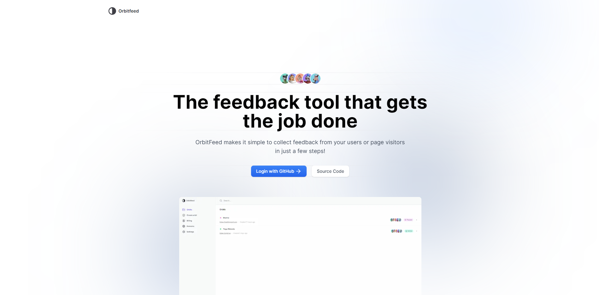

<p align="center">
  
</p>

<p align="left">
  

</p>

<p align="left">
  
  </a>
</p>

## Intro 📜

Orbitfeed is a powerful, user-friendly platform designed to help teams gather, manage, and analyze feedback efficiently. Whether you're looking to improve a product, service, or process, this tool enables you to collect feedback from multiple users, categorize it, and derive actionable insights.

**Read more [here](https://devpost.com/software/orbitfeed-ioy981)**

## Inspiration 🔮

In today's fast-paced, feedback-driven world, collecting and acting on user input is crucial for continuous improvement. However, existing tools often lack the collaboration features necessary to make feedback management a seamless experience for teams. Our inspiration was to create a tool that not only simplifies feedback collection but also fosters collaboration among team members, making the process more efficient and productive.

## Tech Stack 🛠️

- **[Next.js 14](https://nextjs.org)**
- **[Convex](https://convex.dev)**
- **[Tailwind UI](https://tailwindui.com)**
- **[Shadcn](https://ui.shadcn.com)**
- **[Resend](https://resend.com)**
- **[TypeScript](https://www.typescriptlang.org/)**
- **[ESLint](https://eslint.org/)**
- **[Prettier](https://prettier.io/)**
- **[Jest](https://jestjs.io/)**

## Features ✨

- **Real-time Feedback Collection:** Collect feedback from multiple users in real-time and see responses as they come in. This was made possible by Convex's robust realtime architectrue
- **Statuses:** Change status of feedback (pending or resolved)
- **AI Feedback Analysis:** Generate concise summaries of user feedback, providing insights into user satisfaction and concerns & highlighting the key points for quick decision-making
- **User-friendly Interface:** Built with Tailwind UI and Shadcn, the tool offers a clean and intuitive user interface that enhances the user experience.
- **Collaborative Workflows:** Share projects (orbits) with your team to take action on feedback.
- **Emails:** Send and receive emails uisng React Email & Resend
- **Secure Data Management:** All feedback data is securely stored and managed, ensuring privacy and compliance with data protection regulations.

## How to use 🖊️

- Make sure you are [logged in](https://orbitfeed.lol/login).
- After login, you will be redirected to the dashboard where you can [create](https://orbitfeed.lol/create) orbits (feedback projects)
- After creating an orbit, you will be redirected to [/orbits](https://orbitfeed.lol/create) route where you can see your newly created orbit. Choose any one to get started
- On the orbit page, click on the `code` button to configure your orbit
- Follow the instructions from the above step to start collecting feedback on your website
- Good luck!

## Widget ⌨️

The code for the widget can be found [here](https://github.com/lucky-chap/orbitfeed-widget)

## Local development 🧑‍💻

- Clone the project to get started

```
git clone https://github.com/lucky-chap/orbitfeed.git
```

- Copy the contents of `.env.example` into `.env.local` and fill with right values

Run the following commands inside the project folder:

1. `pnpm install`
2. `npx convex dev` (to get convex functions ready)
3. `pnpm dev`

To view the project open `http://localhost:3000`.

## Star ✨

Give me a star would you...

## Contributing 🤝

1. Fork this repository;
2. Create your branch: `git checkout -b my-new-feature`;
3. Commit your changes: `git commit -m 'Add some feature'`;
4. Push to the branch: `git push origin my-new-feature`.

**After your pull request is merged**, you can safely delete your branch.

## License 📝

This project is licensed under the MIT License - see the [LICENSE](LICENSE) file for more information.

## 🔗 Useful links

- https://labs.convex.dev/auth/setup
- https://labs.convex.dev/auth/production
- https://labs.convex.dev/auth/config/email
- https://authjs.dev/getting-started/providers/resend
- https://labs.convex.dev/auth/authz/nextjs#preloading-and-loading-data
- https://labs.convex.dev/auth/authz/nextjs#calling-authenticated-mutations-and-actions
